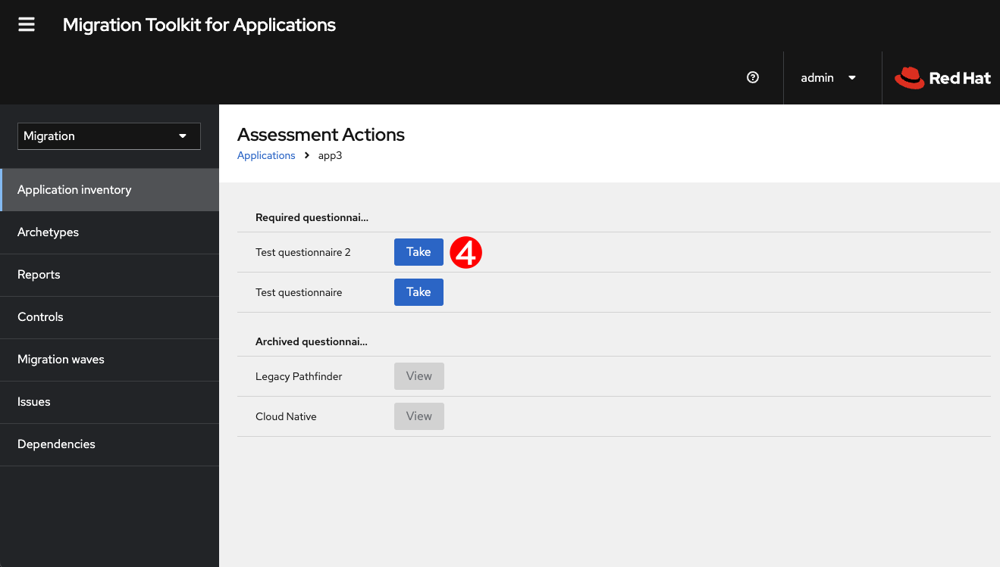

// Module included in the following assemblies:
//
// * docs/web-console-guide/master.adoc

:_content-type: PROCEDURE
[id="mta-web-assessing-apps_{context}"]
= Assessing applications

You can use the {ProductName} ({ProductShortName}) {WebName} to determine the risks involved in containerizing an application.

[NOTE]
====
The procedure described below uses a built-in questionnaire for assessing the risks involved in containerizing an application. By default, this procedure is required prior to reviewing the application. However, you might want to skip this step and use your own questionnaire instead. In that case, use the Skipping assessment option.
====

.Prerequisites

* Log into a server running {ProductShortName}

.Procedure

+
[NOTE]
====
You can assess only one application at a time.
====

// Get updated image for MTA
image::images/mta-assessment-run-01.png[MTA application inventory]

. In the {ProductShortName} user interface, select the *Migration* working mode *.
. Click *Application Inventory* in the left menu bar. A list of all the available applications appears in the main pane. 
. Select an application from the list that appears in the main pane, click the Options menu {kebab} at the right end of the row, and select *Assess* from the drop-down menu.
+
// Get updated image for MTA

. *Assessment Action* appears in the main pane. Select one of the questionnaires and click *Take*.
+
// Get updated image for MTA
image::images/mta-assessment-questions-01.png[Assessment questionnaires]

. *Application assessment* appears in the main pane, showing a list of questions in the defined questionnaire.
. Enter or select the desired answer to each question and click *Next*.
. Click *Save* to start running an assessment on the application.
. Click *Application Inventory* in the left menu to see the assessment status. 
+
* An *In-progess* icon {in-progress} appears under the *Assessment* column for the application shows that {ProductShortName} is assessing the application.
* A *Completed* icon {completed} appears under the *Assessment* column for the application shows that {ProductShortName} has completed assessing the application.

. Click [what to click?] to review the assessment of the application.
