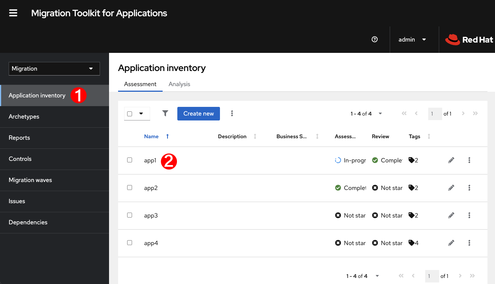
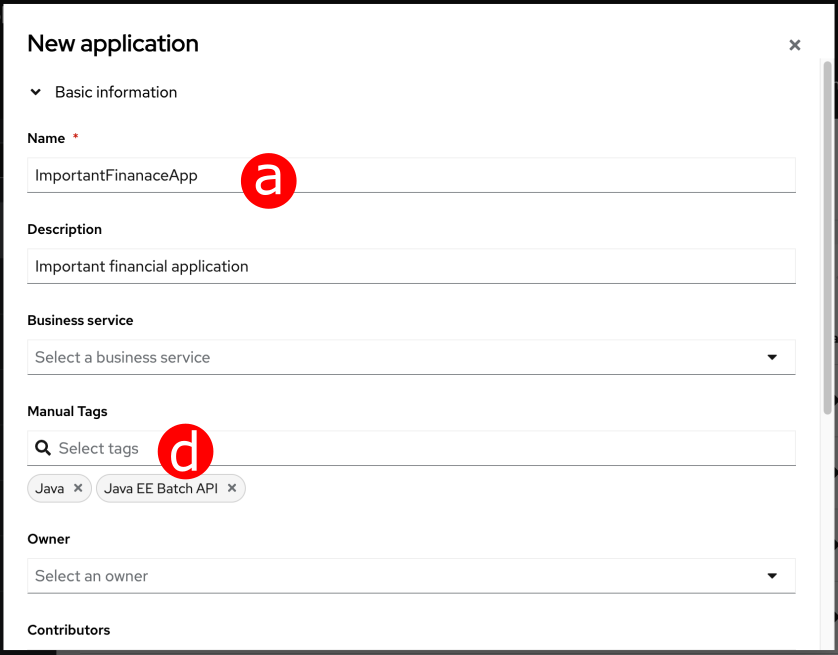
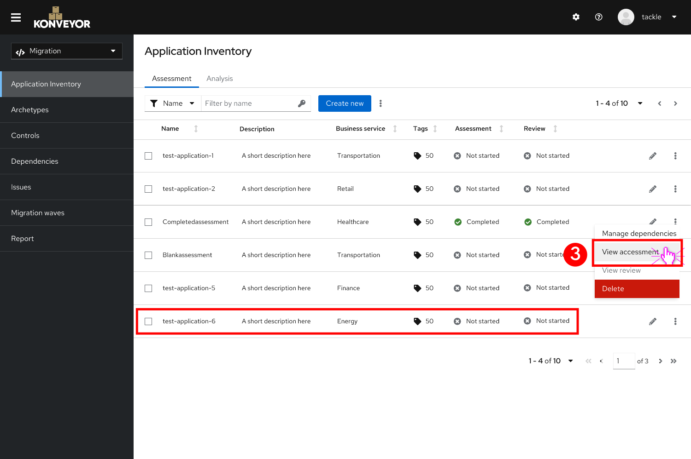

// Module included in the following assemblies:
//
// * docs/web-console-guide/master.adoc
// * topics/mta-assessment-module.adoc

:_content-type: REFERENCE
[id="mta-assessment-module_{context}"]
= Assessment Module

The assessment process for applications that are to be migrated in Red Hat Migration Toolkit for Applications (MTA) has been separated from other tool features and enhanced in version 7.0.0.

* A separate new Assessment hub includes the Assessment module, replacing the older _Pathfinder_ feature.
* Assessment supports multiple questionnaires, relevant to each assessed application.
* Default questionnaires can be customized and saved.
* User can design and version custom questionnaires and questions using YAML syntax.
* Assessed applications are grouped into *archetypes* with similar application characteristics.
* Assessment module integrates tightly with the application inventory.
* Assessment questionnaires can be imported and exported.
* Enhanced questionnaire capabilities:
** Conditional questions
** Application auto-tagging according to answers
** Automated answers from tags in application archetypes

In the MTA user interface, the Assessment Module appears in a separate menu item. Selecting the item shows the currently saved default and custom questionnaires.

:_content-type: PROCEDURE
[id="mta-assessment-start-questionnaire_{context}"]
== Opening an assessment questionnaire

The {ProductName} ({ProductShortName}) assesses applications that are to be migrated according to a set of questions relevant to the application, such as dependencies, *[more question types]*. {ProductShortName} comes with a default questionnaire/s that the user can edit, customize and save as new questionnaires.

.To import an application

// Get updated image for MTA

. Open the {ProductName} user interface and click *Application Inventory* in the left menu bar. *Application assessment* appears in the main pane, listing all the available questionnaires. 
. Click *Create new*. A *New application* dialog appears.

// Get updated image for MTA

[start=3]
. In the form, enter the following information:
.. *Name* of the new application (mandatory)
.. *Description* of the application (optional)
.. *Business service* is thepurpose of the application (optional)
.. *Tags* software tags that charecterize the application (mandatory)
.. *Owner* select regitered software owner from drop-down list (optional)
.. *Contributors* select contributors from drop-down list (optional)
.. *Comments* enter comments on the migrated application
. Click *Source code* and enter the following fields.
.. *Repository type* select *Git* or *Subversion* (mandatory)
.. *Source Repository* paste the URL of the repository where the software code is saved (mandatory)
.. *Branch* enter the repository branch that is to be migrated (mandatory)
.. *Root path* [get info] (optional/mandatory)
. Click *Binary* and enter the following fields.
.. *Group* [get info] (optional/mandatory)
.. *Artifact* [get info] (optional/mandatory)
.. *Version* software version of the application
.. *Packaging* [get info] (optional/mandatory)
. Click *Create*.

.To open a saved application

// Get updated image for MTA

. Open the {ProductName} user interface and click *Application Inventory* in the left menu bar. *Application assessment* appears in the main pane, listing all the available questionnaires. 
. Review all the applications and click *Take* to the right of the selected questionnaire. The main pane shows a list of defined assessments.

// Get updated image for MTA

[start=3]
. Right click one of the defined assessments and select *view assessment*. The main pane shows the list of questions in the assessment, separated into categories.

// Get updated image for MTA
image::images/assessment-view-assessment-03.png[]

[start=4]
. On the left of the main pane, click on a questions category. A list of questions for the category appears to the right of the categories list.
. Click the down arrow to the left of one of the questions. A list of answer options appears below the list of questions.
. Select one of the answers under *Answer choice*.

:_content-type: PROCEDURE
[id="mta-assessment-start-questionnaire_{context}"]
=== Opening an assessment questionnaire
